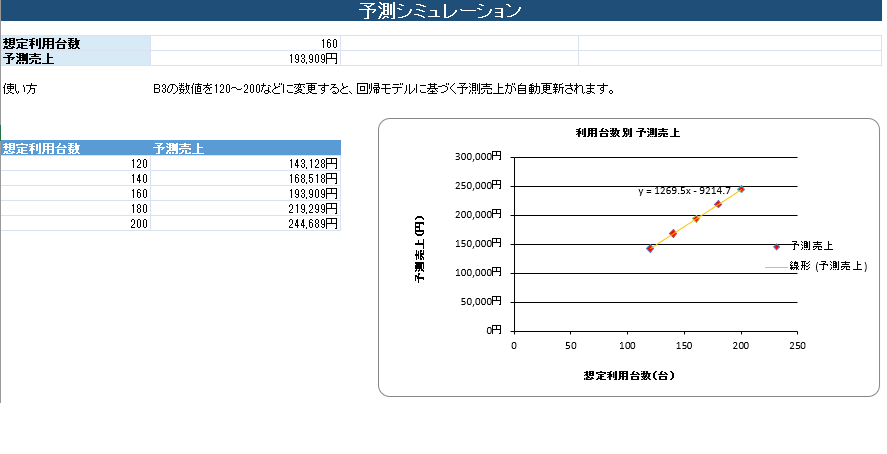

# 駐車場利用実績 集計・分析・予測ツール（Excel）

* **目的**: 駐車場の利用実績データをもとに、データクレンジングから基本統計、回帰分析による売上予測、集計、可視化までを行う。
実務における社内向けExcelツールの作成・改修、データクレンジング、定型集計、業務効率化、分析結果のレポートを想定。
* **データ規模**: 架空データ（4拠点・約500日分）

---

## 予測シミュレーションシート

回帰分析モデル（y = 1269.5x - 9214.7）をベースに、利用台数を変更すると自動的に売上予測と散布図・近似曲線グラフが連動する仕組みを実装しています。

---

## 主なExcel機能

SUBSTITUTE / AVERAGE / MEDIAN / MAX / MIN / COUNT  /STDEVP / CORREL / SLOPE / INTERCEPT / FORECAST / テーブル  / ピボットテーブル / ピボットグラフ / ヒートマップ

---

## シート構成

本ツールは以下の6つのシートで構成されており、データ分析を再現しています。

1. **実績データ**
   * 日付、曜日、駐車場名、時間帯、利用台数、売上、稼働率、平均利用時間、天候
2. **クレンジング**
   * 表記ゆれのある駐車場名（原文）を関数（`SUBSTITUTE`等）を用いて「駐車場名（クレンジング済）」に統一・整形。
3. **統計分析**
   * データ件数、平均値、中央値、標準偏差などの基本統計量を算出。
   * 利用台数と売上の相関関係や回帰分析（回帰係数・切片）を実施し、解説。
4. **集計**
   * ピボット集計を活用し、拠点別の総利用台数、総売上、平均利用台数、平均稼働率、売上構成比を算出。
5. **ダッシュボード**
   * 総売上、平均稼働率、平均利用台数、相関係数などを表示し、状況を把握できる。
6. **予測シミュレーション**
   * 想定利用台数（例：160台）を入力すると、回帰モデルに基づいて予測売上が自動計算される。

---

## ファイルのダウンロード
リポジトリ内の `駐車場利用実績_集計分析ツール_ポートフォリオ.xlsx` をダウンロードして、Excelでの動作や数式、ダッシュボードをご確認いただけます。
